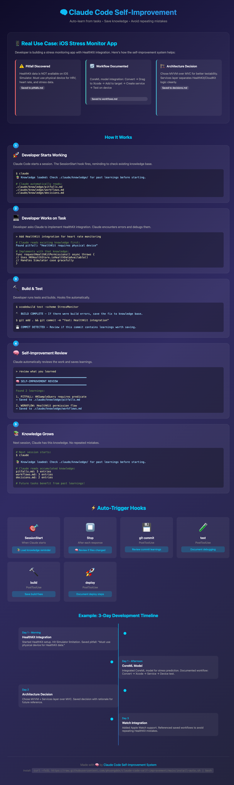

# Claude Code Self-Improvement System 🧠

> Auto-learn from tasks • Save knowledge • Avoid repeating mistakes



## Quick Install

```bash
curl -fsSL https://raw.githubusercontent.com/phuongddx/claude-code-self-improvement/main/install-auto.sh | bash
```

## What Is This?

A self-improvement system for Claude Code that automatically:
- 📝 Saves learnings from your work
- ⚠️ Documents pitfalls you encounter
- 🔄 Records workflows that work well
- 🏗️ Tracks architecture decisions
- 🔍 Checks past knowledge before new tasks

## Real Use Case: iOS Stress Monitor App

Here's how it works in practice:

### Day 1: HealthKit Integration
```
Developer: "Add HealthKit integration for heart rate monitoring"

Claude reads existing knowledge:
📚 Found pitfall: "HealthKit requires physical device"

Claude implements with that knowledge:
✅ Handles Simulator case gracefully
```

**Pitfall saved:**
```markdown
## [2026-06-02] HealthKit Simulator Limitations

**Context:** Testing HealthKit integration on iOS Simulator
**Learning:** HealthKit data is NOT available on Simulator
**Application:** Always check isHealthDataAvailable() first
```

### Day 2: CoreML Model
```
Developer: "Integrate CoreML model for stress prediction"

Claude documents workflow:
📝 Saved to workflows.md: "CoreML integration: Convert → Xcode → Service → Device test"
```

### Day 3: Watch Integration
```
Developer: "Add Apple Watch support"

Claude reads saved knowledge:
📚 Found workflow: "HealthKit permission flow"
📚 Found pitfall: "Must use physical device"

✅ No repeated mistakes!
```

## Auto-Trigger Hooks

The system automatically reminds you to review:

| Hook | When | What It Does |
|------|------|--------------|
| 🎯 `SessionStart` | Claude starts | Loads knowledge reminder |
| ⏹️ `Stop` | After response | Reviews if files changed |
| 💾 `git commit` | Post-commit | Reviews commit learnings |
| 🧪 `test` | Post-test | Documents debugging |
| 🔨 `build` | Post-build | Saves build fixes |
| 🚀 `deploy` | Post-deploy | Documents deploy steps |

### Example Hook Output

```bash
$ git commit -m "feat: HealthKit integration"

💾 COMMIT DETECTED — Review if this commit contains learnings worth saving.

$ xcodebuild test -scheme StressMonitor

🔨 BUILD COMPLETE — If there were build errors, save the fix to knowledge base.
```

## Knowledge Files

```
.claude/
├── skills/
│   └── self-improvement-review.md    # Auto-triggered skill
├── knowledge/
│   ├── pitfalls.md                   # Debugging discoveries
│   ├── workflows.md                  # Proven procedures
│   └── decisions.md                  # Architecture choices
└── settings.json                     # Hook configuration
```

### Example Entries

**pitfalls.md:**
```markdown
## [2026-06-02] HealthKit Simulator Limitations

**Context:** Testing HealthKit on Simulator
**Learning:** HealthKit data requires physical device
**Application:** Check isHealthDataAvailable() first
**Example:** HKHealthStore.isHealthDataAvailable() returns false on Simulator
```

**workflows.md:**
```markdown
## [2026-06-02] CoreML Model Integration

**Context:** Adding new ML model to iOS app
**Workflow:**
1. Convert model to .mlmodel format
2. Drag into Xcode project
3. Add to target membership
4. Create prediction service
5. Test on device
```

**decisions.md:**
```markdown
## [2026-06-02] MVVM over MVC

**Context:** Choosing architecture for StressMonitor
**Decision:** MVVM with Services layer
**Rationale:**
- Better testability (ViewModels are pure Swift)
- Cleaner separation of HealthKit/CloudKit logic
- SwiftUI works naturally with MVVM
```

## Manual Trigger

Say any of these to trigger review:
- "review what you learned"
- "save this as a pitfall/workflow"
- "remember this for next time"

## Check Knowledge Before Tasks

Say:
- "check if we've done this before"
- "look in knowledge files for X"
- "what pitfalls should I know about?"

## 3-Day Development Timeline

```
Day 1 Morning:    HealthKit Integration → Saved pitfall
Day 1 Afternoon:  CoreML Model → Documented workflow  
Day 2:            Architecture → Saved decision
Day 3:            Watch Integration → Used saved knowledge
```

## Installation

### One-Line Install (Recommended)
```bash
curl -fsSL https://raw.githubusercontent.com/phuongddx/claude-code-self-improvement/main/install-auto.sh | bash
```

### Manual Install
```bash
git clone https://github.com/phuongddx/claude-code-self-improvement.git
cd claude-code-self-improvement
cp -r .claude /path/to/your/project/
```

### Files Installed
```
your-project/
├── .claude/
│   ├── skills/
│   │   └── self-improvement-review.md
│   ├── knowledge/
│   │   ├── pitfalls.md
│   │   ├── workflows.md
│   │   └── decisions.md
│   └── settings.json
└── CLAUDE.md
```

## How It Works

1. **SessionStart hook** fires when Claude starts → reminds to load knowledge
2. **Stop hook** fires after each response → reminds to review if files changed
3. **PostToolUse hooks** fire after git/test/build/deploy → specific reminders
4. **Claude reads knowledge** before starting tasks → avoids past mistakes
5. **Claude saves learnings** after significant tasks → knowledge grows

## Tips

1. **Be specific** — "HealthKit fails on Simulator" is better than "Testing issues"
2. **Include examples** — Code snippets, commands, error messages
3. **Date entries** — Helps track when knowledge was learned
4. **Prune old entries** — Review quarterly, remove outdated info
5. **Share with team** — Commit `.claude/knowledge/` to repo

## Pitfalls to Avoid

1. **Don't over-document** — Skip trivial learnings
2. **Don't duplicate** — Search before adding
3. **Don't add secrets** — No API keys, passwords, tokens
4. **Don't add general knowledge** — Only project-specific learnings
5. **Review quality** — Bad knowledge is worse than no knowledge

## License

MIT

---

Made with 🧠 by [phuongddx](https://github.com/phuongddx)
